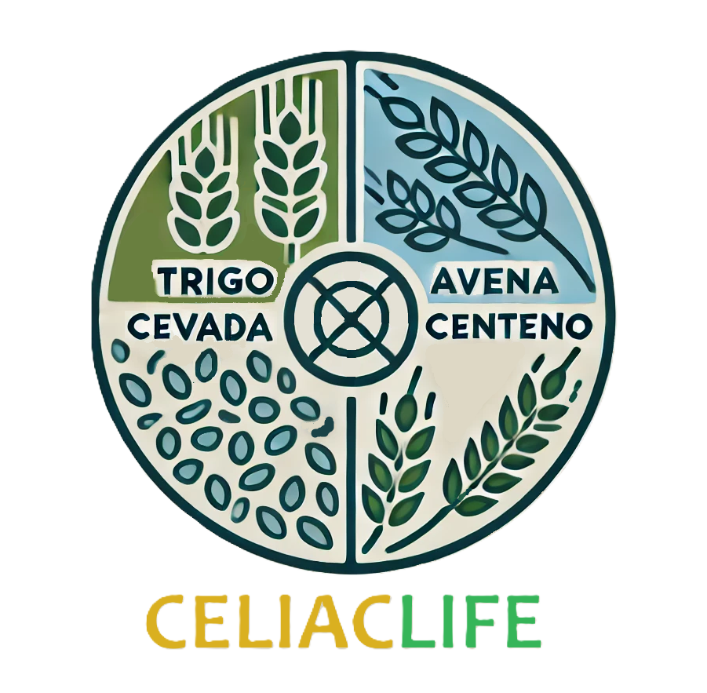

# CeliacLife



## Descripción
CeliacLife es una aplicación móvil diseñada para personas celiacas, proporcionando una herramienta integral para llevar una vida saludable sin gluten. La aplicación ofrece recetas sin TACC, localización de tiendas y restaurantes con opciones sin TACC, y consejos sobre nutrición y manejo de la celiaquía.

## Tabla de Contenidos
1. [Instalación](#instalación)
2. [Uso](#uso)
3. [Pantallas](#pantallas)
4. [Estructura del Proyecto](#estructura-del-proyecto)
5. [Base de Datos de Firebase](#base-de-datos-de-firebase)
6. [Contribución](#contribución)
7. [Licencia](#licencia)
8. [Contacto](#contacto)

## Instalación
Sigue estos pasos para instalar y ejecutar el proyecto localmente.

```bash
git clone https://github.com/tu-usuario/CeliacLife.git
cd CeliacLife
npm install
```

### Configuración de Firebase
1. Crea un proyecto en [Firebase](https://firebase.google.com/).
2. Añade la configuración de Firebase a tu proyecto.
3. Actualiza los archivos de configuración en `src/config/firebase.js`.

### Ejecución
Para ejecutar la aplicación en modo de desarrollo:

```bash
npm start
```

## Uso
- **Inicio de Sesión y Registro:** Permite a los usuarios crear una cuenta o iniciar sesión.
- **Recetas:** Navega y busca recetas sin TACC.
- **Consejos:** Lee artículos y consejos sobre cómo manejar la celiaquía.
- **Mapa:** Encuentra tiendas y restaurantes con opciones sin TACC cerca de ti.

## Pantallas
1. **HomeScreen:** Pantalla de inicio que muestra una introducción a la aplicación.
2. **LoginScreen:** Pantalla de inicio de sesión.
3. **SignupScreen:** Pantalla de registro de usuario.
4. **RecipesScreen:** Pantalla principal de recetas, mostrando categorías de recetas.
5. **RecipeCategory:** Pantalla que muestra las subcategorías de recetas.
6. **RecipeList:** Lista de recetas en una subcategoría.
7. **RecipeItem:** Detalles de una receta específica.
8. **TipsScreen:** Pantalla que muestra una lista de consejos sobre celiaquía.
9. **TipItem:** Detalles de un consejo específico.
10. **MapCeliacScreen:** Pantalla que muestra un mapa con tiendas y restaurantes con opciones sin TACC.
11. **UserScreen:** Pantalla de perfil del usuario, donde pueden actualizar su información personal.

## Estructura del Proyecto
```
CeliacLife/
│
├── assets/
│   ├── images/
│   │   ├── icon-almuerzo.png
│   │   ├── icon-bebidas.png
│   │   ├── icon-cena.png
│   │   ├── icon-desayuno.png
│   │   ├── icon-merienda.png
│   │   ├── Logo-CeliacLife.png
│   │   └── profile-image.png
│   └── Icon-CeliacLife.png
│
├── src/
│   ├── components/
│   │   ├── LocationSelector.jsx
│   │   ├── MapPreview.jsx
│   │   └── MapViewComponent.jsx
│   │
│   ├── contexts/
│   │   └── AuthContext.js
│   │
│   ├── databases/
│   │   ├── realtimeDatabase.js
│   │   ├── sqliteConfig.js
│   │   └── users.js
│   │
│   ├── navigation/
│   │   ├── AuthStack.js
│   │   └── Navigation.js
│   │
│   ├── redux/
│   │   ├── store.js
│   │   ├── slices/
│   │   │   ├── recipesSlice.js
│   │   │   ├── tipsSlice.js
│   │   │   └── UserSlice.js
│   │
│   ├── screens/
│   │   ├── HomeScreen.js
│   │   ├── LoginScreen.js
│   │   ├── MapCeliacScreen.js
│   │   ├── RecipeCategory.js
│   │   ├── RecipeItem.js
│   │   ├── RecipeList.js
│   │   ├── RecipesScreen.js
│   │   ├── SignupScreen.js
│   │   ├── TipItem.js
│   │   ├── TipsScreen.js
│   │   └── UserScreen.js
│   │
│   ├── services/
│   │   ├── authService.js
│   │   ├── firebaseApi.js
│   │   └── storageService.js
│   │
│   └── utils/
│       ├── styles.js
│       └── theme.js
│
├── .gitignore
├── App.js
├── app.json
├── babel.config.js
├── package.json
└── package-lock.json
```

## Base de Datos de Firebase
### Realtime Database
La estructura de la base de datos en tiempo real de Firebase es la siguiente:
```
{
  "users": {
    "user1": {
      "name": "Nombre",
      "surname": "Apellido",
      "birthDate": "Fecha de Nacimiento",
      "gender": "Género",
      "email": "Correo Electrónico"
    },
    "user2": {
      // más usuarios
    }
  },
  "recipes": {
    "category1": {
      "recipe1": {
        "title": "Título de la Receta",
        "ingredients": "Ingredientes",
        "instructions": "Instrucciones"
      },
      "recipe2": {
        // más recetas
      }
    }
  },
  "tips": {
    "tip1": {
      "title": "Título del Consejo",
      "content": "Contenido del Consejo"
    },
    "tip2": {
      // más consejos
    }
  }
}
```

## Actualiaciones:
Las actualiaciones futuras:

1. Modificación de Imagen de Perfil de Usuario.
2. Agregar tienda nueva en Mapa de Tiendas de tproductos Sin Tacc.
3. Agregar nuevas recetas de usuarios registrados.
4. Notificaciones por email de nuevas tiendas.

## Licencia
Este proyecto está licenciado bajo la Licencia MIT. Ver el archivo [LICENSE](LICENSE) para más detalles.

## Contacto
Para preguntas o soporte, contacta a [Oscar Lizzi](mailto:oscarlizzi@gmail.com).
